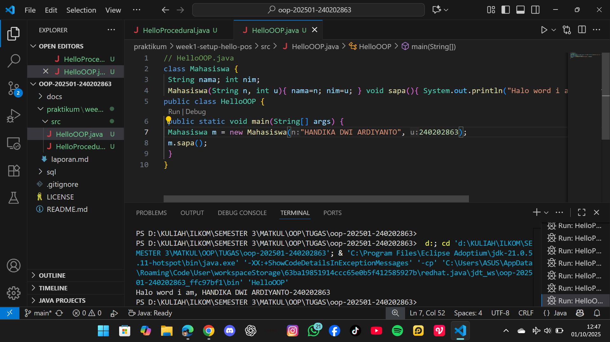

# Laporan Praktikum Minggu 1 (sesuaikan minggu ke berapa?)
Topik: ["Paradigma Pemrograman: Prosedural, OOP, dan Fungsional"]

## Identitas
- Nama  : [HANDIKA DWI ARDIYANTO]
- NIM   : [240202863]
- Kelas : [3IKRA]

---

## Tujuan
(Mahasiswa memahami perbedaan pendekatan prosedural, OOP, dan fungsional.)

---

## Dasar Teori
( 1. Paradigma Prosedural: Menyelesaikan masalah dengan urutan langkah (algoritma) berupa prosedur atau fungsi.

2. Paradigma OOP (Object Oriented Programming): Berfokus pada object yang memiliki atribut (data) dan method (fungsi).

3. Paradigma Fungsional: Memanfaatkan fungsi murni yang bebas dari efek samping untuk menyelesaikan masalah.

4. Tiap paradigma memiliki kelebihan dan kekurangan tergantung skala dan tujuan program.

5. GitHub digunakan untuk menyimpan dan berbagi kode dengan sistem kontrol versi.)

---

## Langkah Praktikum
(1. Membuat project baru dan menyiapkan 3 file java:
      helloProcedural.java
      helloOOP.java
      helloFunctional.java
2. Menuliskan kode program untuk menampilkan "Hello World, I am <nama>-<nim>" dengan tiga pendekatan.
3. Menjalankan program menggunakan java <nama_file>.java.
4. Commit message yang digunakan:
Isi tiap file dengan kode sesuai paradigma:

Prosedural → pakai main() dengan urutan instruksi langsung.

OOP → buat class Mahasiswa dengan constructor dan method sapa().

Fungsional → pakai interface fungsional (BiFunction) atau lambda expression.)

---

## Kode Program
(1. Prosedural
// HelloProcedural.java
public class HelloProcedural {
   public static void main(String[] args) {
      String nim = "240202863";
      String nama = "HANDIKA DWI ARDIYANTO";

      System.out.println("hello word, im " + nama +"-"+ nim );
   }
}
2. OOP
// HelloOOP.java
class Mahasiswa {
 String nama; int nim;
 Mahasiswa(String n, int u){ nama=n; nim=u; } void sapa(){ System.out.println("Halo word i am, " + nama +"-"+ nim); }}
public class HelloOOP {
 public static void main(String[] args) {
 Mahasiswa m = new Mahasiswa("HANDIKA DWI ARDIYANTO", 240202863);
 m.sapa();
 }
}
3. Functional
import java.util.function.BiConsumer;
public class HelloFunctional {
 public static void main(String[] args) { BiConsumer<String,Integer> sapa =
 (nama, nim) -> System.out.println("Halo Word I am, " + nama + "-" + nim);
 sapa.accept("HANDIKA DWI ARDIYANTO", 240202863);
 }
}
)
---

## Hasil Eksekusi
(Sertakan screenshot hasil eksekusi program.  

)
---

## Analisis
( 1. Prosedural: Mudah dipahami, cocok untuk program kecil, tetapi sulit dipelihara untuk aplikasi besar.
   2. OOP: Lebih terstruktur, mendukung modularisasi, dan cocok untuk program kompleks.
   3. Fungsional: Lebih ringkas, minim efek samping, tetapi tidak selalu mudah dipahami    bagi pemula.
   4. Kendala: Tidak ada kendala berarti, hanya perlu ketelitian dalam penulisan sintaks Java.  
)
---

## Kesimpulan
(1. Tiga paradigma pemrograman memberi cara pandang berbeda dalam menyelesaikan masalah.
   2. Prosedural cocok untuk program sederhana, OOP untuk aplikasi besar, fungsional untuk kode matematis atau deklaratif.
   3. Praktikum ini juga melatih penggunaan GitHub untuk menyimpan dan berbagi kode.)

---

## Quiz
(1. [Apakah OOP selalu lebih baik dari prosedural? ]  
   **Jawaban:** …Tidak selalu, OOP cocok untuk sistem besar, prosedural lebih sederhana untuk program kecil.  

2. [Kapan functional programming lebih cocok digunakandibanding OOP atau prosedural? ]  
   **Jawaban:** …Functional lebih cocok saat mengolah data besar, parallel processing, atau butuh kode mudah diuji.

3. [ Bagaimana paradigma (prosedural, OOP, fungsional)
memengaruhi maintainability dan scalability aplikasi? ]  
   **Jawaban:** …Prosedural sulit di-maintain untuk aplikasi besar, OOP lebih modular dan scalable, fungsional ringkas serta efisien.

4. [Mengapa OOP lebih cocok untuk mengembangkan
aplikasi POS dibanding prosedural? ]  
   **Jawaban:** …OOP lebih cocok untuk POS karena dapat memodelkan entitas (produk, pelanggan, transaksi) dengan class yang mudah dikembangkan. 

5. [Bagaimana paradigma fungsional dapat membantu
mengurangi kode berulang (boilerplate code)? ]  
   **Jawaban:** …Fungsional mengurangi boilerplate dengan fungsi murni dan higher-order functions sehingga kode lebih ringkas dan reusable.)
